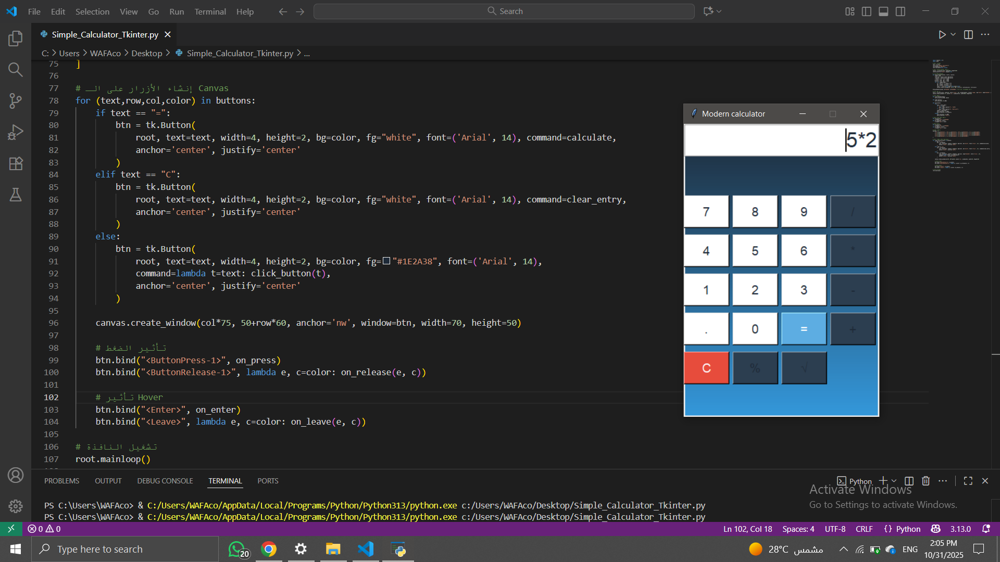

# Simple Calculator - Tkinter
A simple calculator using Python and Tkinter.

## Skills Acquired
- Graphical User Interface (GUI)
- Using Buttons and Entry - Handling Events (Hover, Click)
- Mathematical Operations + Square Root and %
- Improving Design and Colors

## Interface Example

